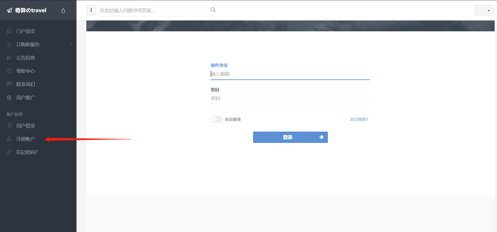
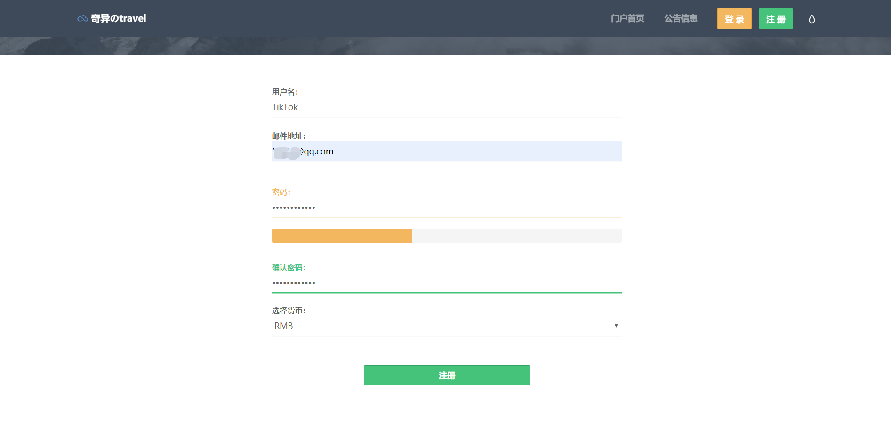
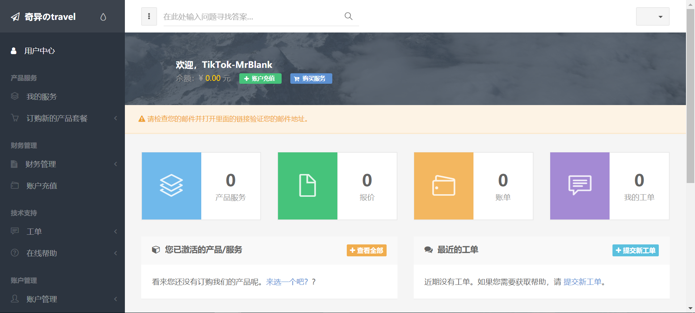
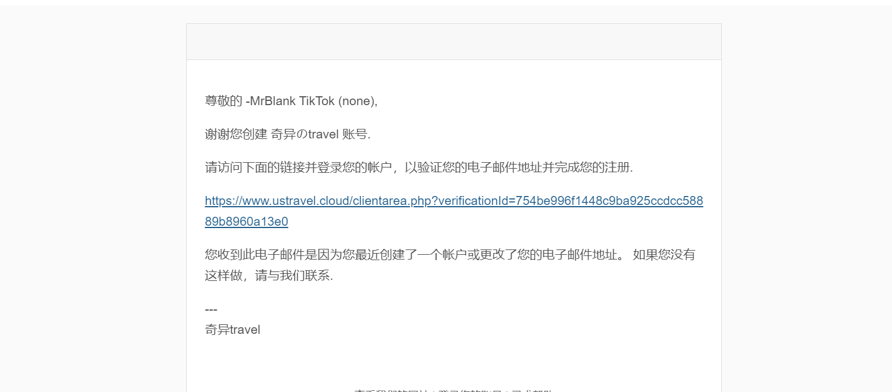
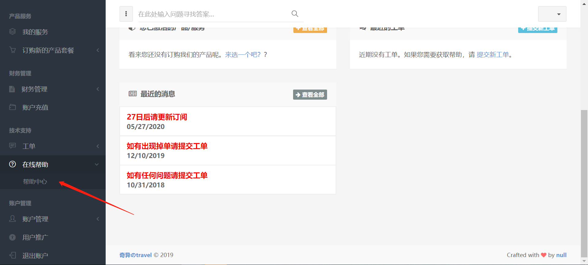
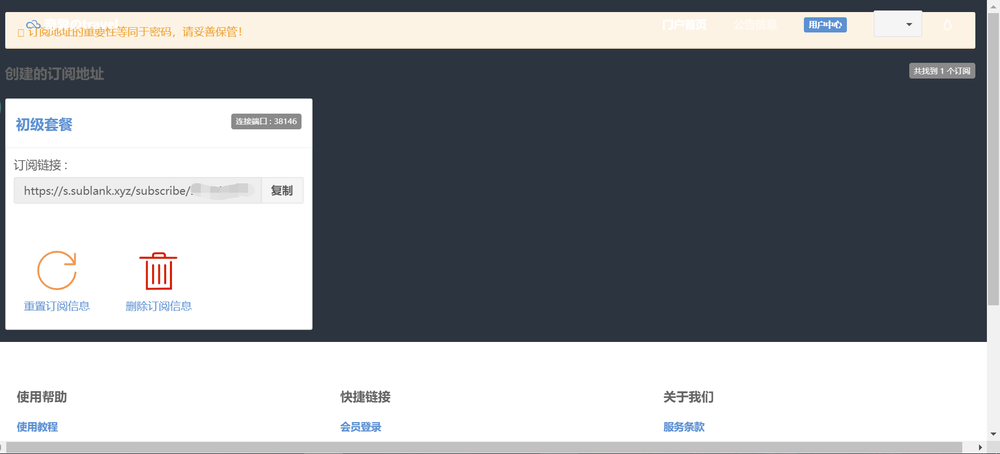

# 十分钟搞定科学上网 

计算机专业背景，经常需要上网查询资料。用了几种方式后，以下这种是最简单便捷的。 
* 不需要搭建服务器 
* 不需要懂得计算机知识 
* 全平台通用，windows, mac, andorid, ios
* 20+各国节点随意切换
* 多人同时使用

只需要完成以下4个步骤：

信息注册---->购买服务---->下载软件---->添加订阅地址

（1） 注册信息
**网址：** https://www.ustravel.cloud/aff.php?aff=5750

点击箭头指示部分，跳转页面填写个人信息

（2）登入账号

（3）验证邮箱

（4）选择套餐
* 建议选择标准套餐。我用初级套餐有部分节点无法使用，速度也比较慢。

（5）查看使用帮助

* 下载对应软件
如果因网络原因无法下载，可以参考以下链接。

【百度网盘】
https://pan.baidu.com/s/1msYZYlGr8woa4M1fSuMjAA 

提取码：ksvc

**订阅地址**

非常重要，不能泄露！
非常重要，不能泄露！
非常重要，不能泄露！

（6）成功上网
* 电脑端

* IOS 端（使用shadowrockt）

