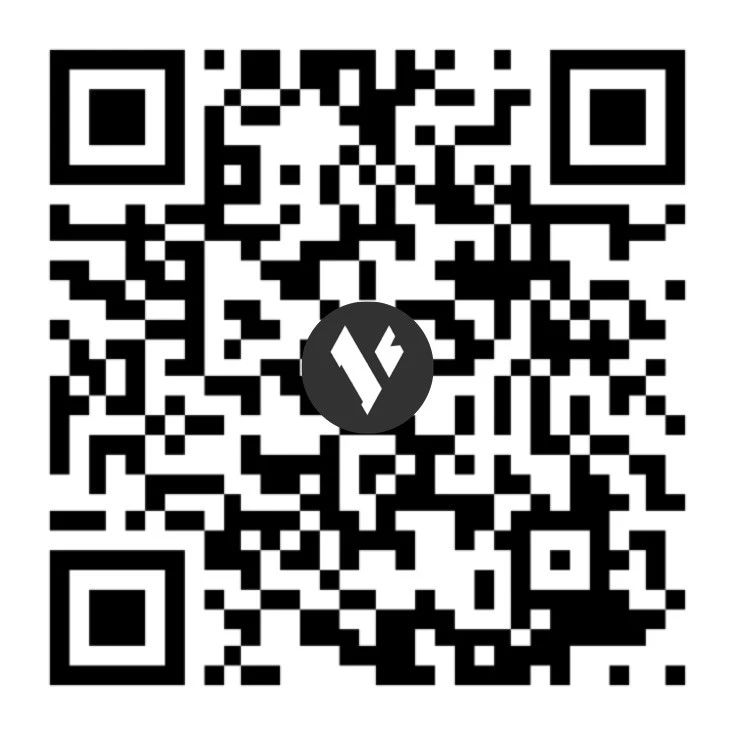
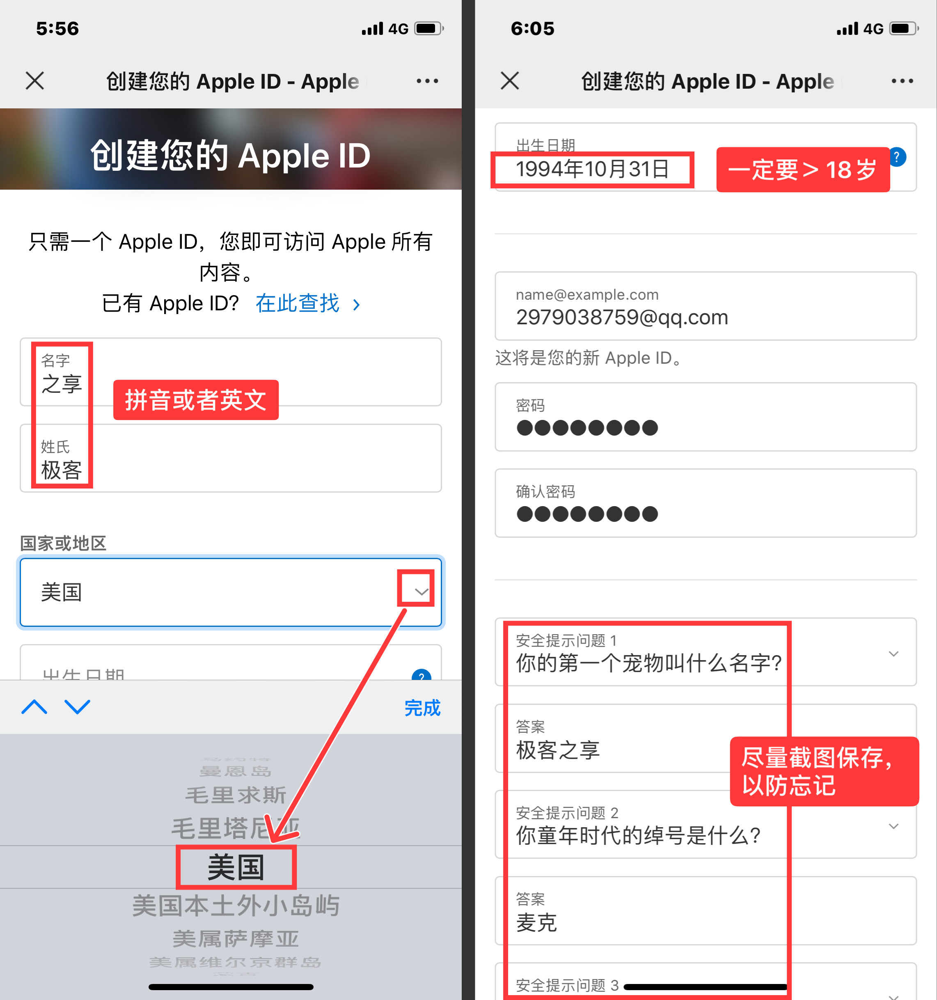
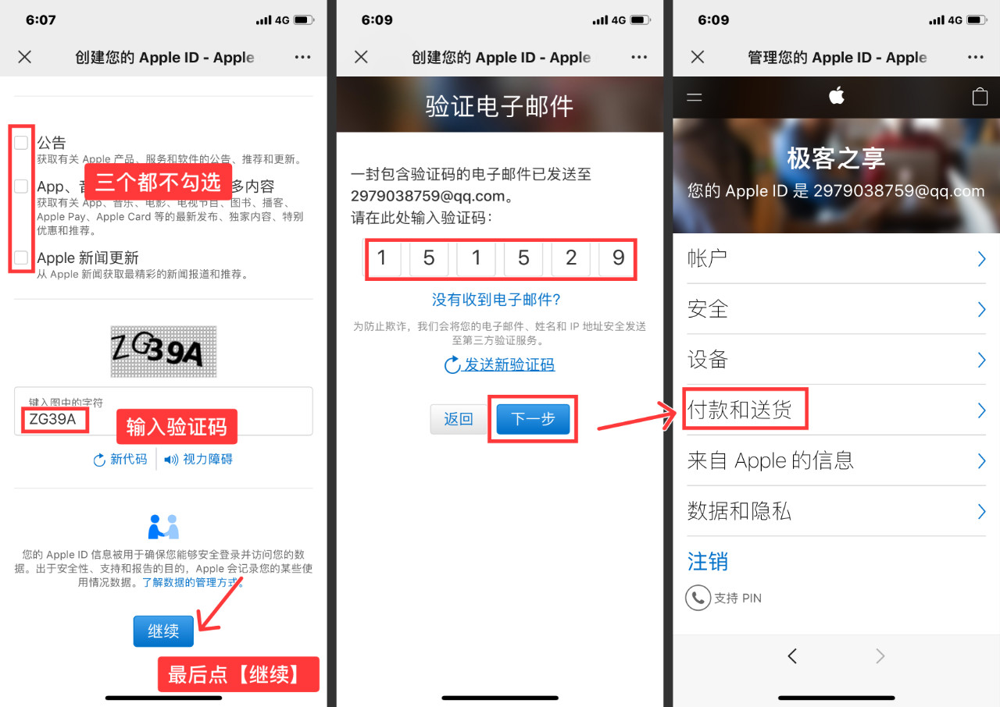
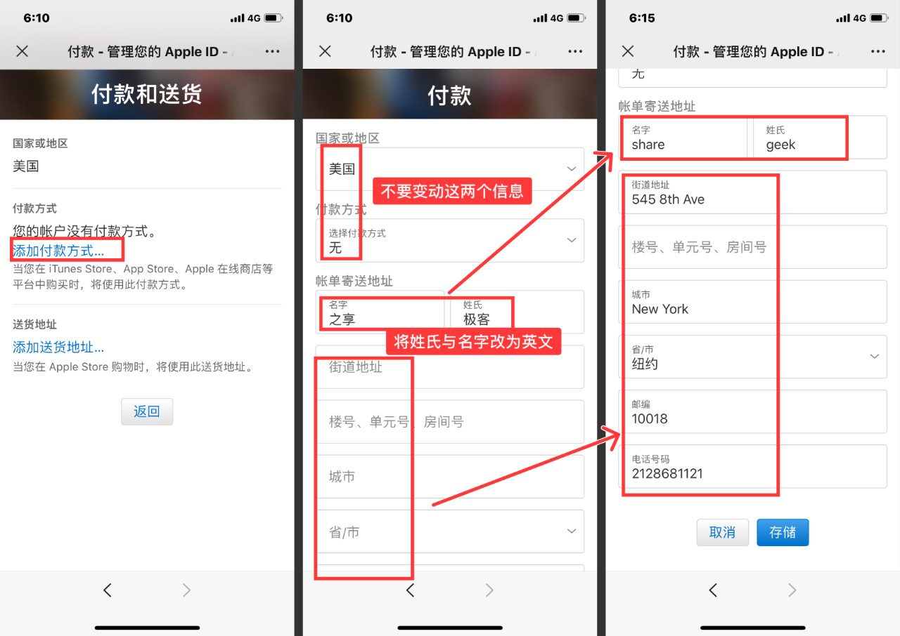
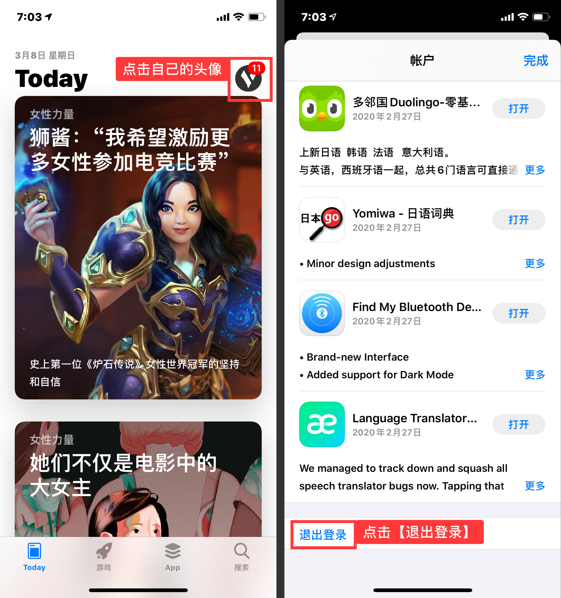
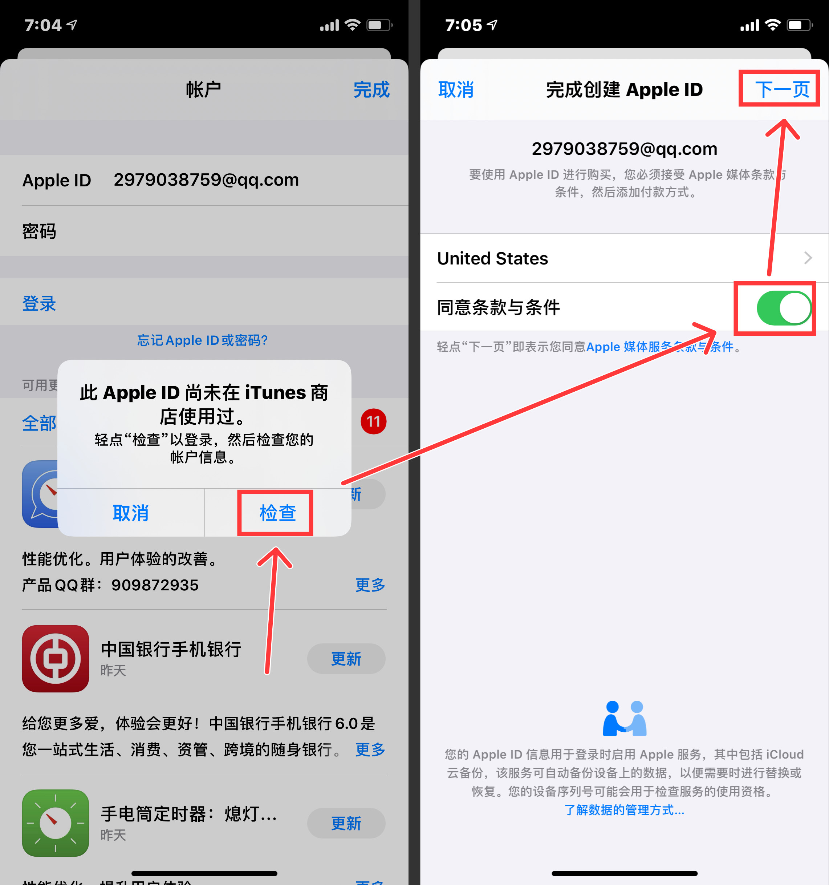
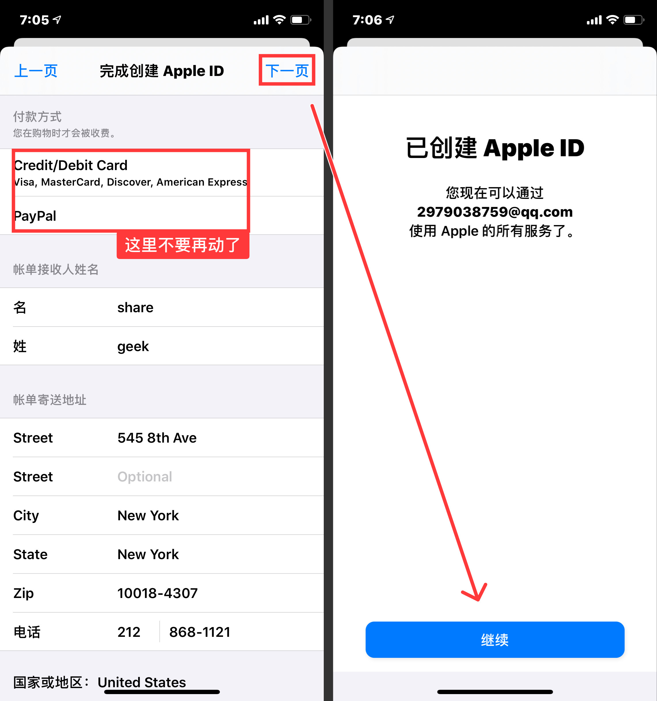

# 十分钟注册美区Apple ID

**注意：** 该教程应该是目前注册苹果美区账号「**最快的方法**」，且适合所有人。别看步骤多，其实很简单。

**详细图文教程**

**① 注册一个新邮箱账号**

首先注册一个新邮箱账号，国内的**「**qq、126、163****等等**」**都行，只要账户**没注册过 Apple ID 就行**。

**② 通过官方网页注册**

长按识别下方二维码，进入苹果 Apple ID 注册页面。

*   姓氏及名字输入「**英文或拼音**」

*   国家或地区选择「**美国**」

*   出生日期设置「**大于 18 岁**」

输入你的新邮箱账号、设置好ID密码及安全提示问题，「**建议截图保存**」。

提示问题下方「**三个选项不要勾选**」，否则收到广告邮件；输入验证码后直接点「**继续**」。

你的新邮箱会收到来自苹果的「**6 位数验证码**」，填写后点「**下一步**」进入账号管理页面，然后点「**付款和送货**」，再点「**添加付款方式**」。

*   国家和地区选择「**美国**」

*   付款方式：「**无**」

*   街道地址、城市、省、邮编、电话号码等信息可以用网上的“**美国地址生成器**”生成，用麦克的截图上的

输入这些信息后保存即可。到这，一个美区 Apple ID 就算是注册成功了。

**③ 登陆 App Store**

打开「**App Store**」，点击右上角头像进入账户界面，下拉到最底部，点击「**退出登录**」即可退出当前账号。

退出后，登录你刚注册好的「**美区账号及密码**」。第一次登陆，会需要简单验证一下，点击「**检查**」。

点开「**同意条款与条件**」，接着点「**下一页**」。

会进入下图的界面，来到这个页面后，**不需要你再改动了**，直接点「**下一步**」。

最后点「**继续**」，这样一个美区账号就创建成功了。

**温馨提示**

登录美区账号后，App Store 会自动切换到英文界面，同时在底部菜单栏会多出一个「**Arcade**」--苹果游戏订阅服务。

使用上无区别，直接搜索下载应用或游戏点击安装就行。建议用完退出，再换回国区账号。

**美区购买App**

总会有小伙伴会需要在美区的App Store里购买 App，无法充值怎么办？

大家「**前往某宝购买美区充值卡**」即可搞定，但 **网购须谨慎**。

**最后想说**

其实美区 Apple ID 还是很有用的，了你就会发现很多好用的 App 在国区里是不会上架的，但在美区账号里却可以找到。

（本文来自网上，侵权请联系我，我会速删）